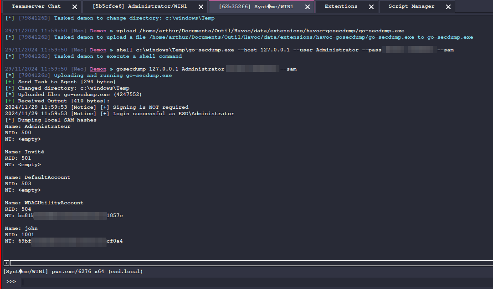

# havoc-gosecdump

>This module will upload the gosecdump binary to a temporary folder under windows  (it's better to use AppData or ProgramData)

# Usage

`gosecdump <target_ip> <user> <password> <sam/lsa/dcc2>`

It can be used in 127.0.0.1 but it is more intended to dumper the SAM/LSA/DCC2 on a remote machine that our compromised machine can reach.

This binary bypasses EDR-type solutions